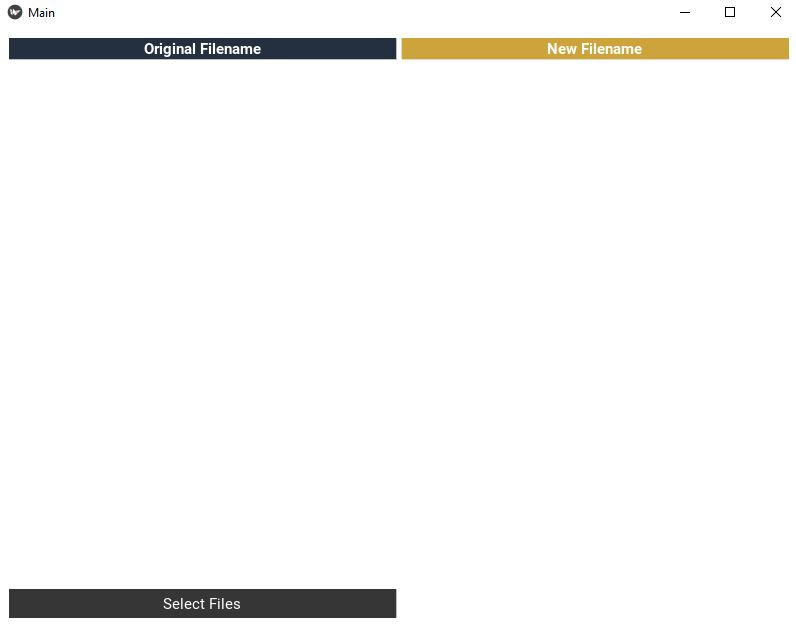
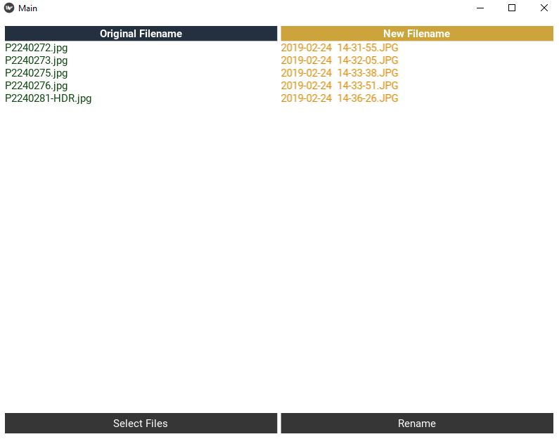
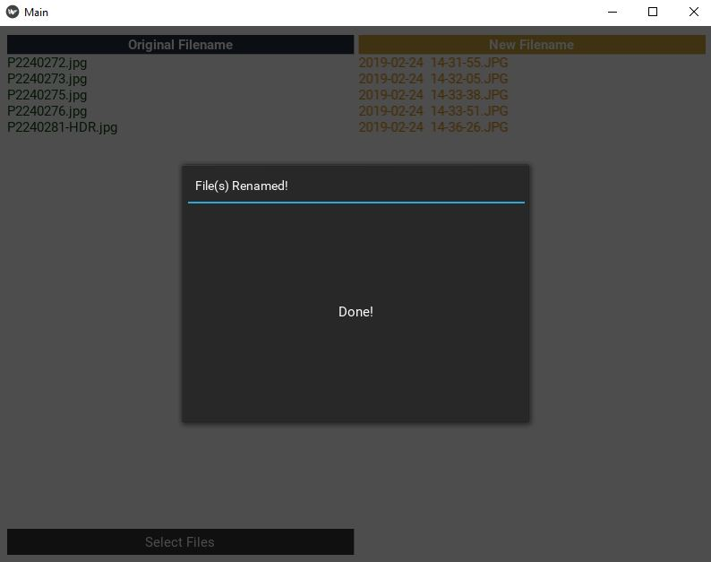

# EXIF-Renamer

A GUI that allows users to select image files on their computer, and rename them based on the date the picture(s) were captured (e.g. **%Y-%m-%d  %H-%M-%S**). 
This information is obtained via the EXIF. As an enthusiast photographer, this is the way I prefer to rename and organize my images.

Uses [Phil Harvey's Exiftool](https://exiftool.org/) command-line application. **The executable file will need to be downloaded**, and is OS specific; also used [sylikc's pyexiftool](https://github.com/sylikc/pyexiftool) wrapper.

Limitation: 
files have to be selected one at a time via the file browser, as opposed to being able to use shortcut keys, or the 
mouse to drag and select multiple files at once. This is due to the limitation of [Kivy](https://kivy.org/#home), which is optimized for mobile devices. In retrospect, I would consider 
using another GUI framework.

